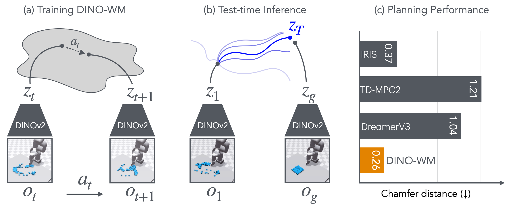
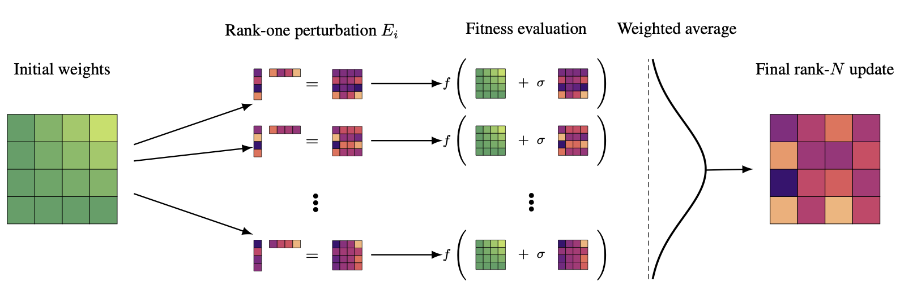

<!-- _paginate: false -->

Group Meeting · 2026-06-08

# 从无梯度 SNN 到 DINO-WM 世界模型路线

三周进展：ES / nano-egg 文献与工程适配，SNN-WAM 路线从 action-BC 收缩到 DINOv2 patch-latent dynamics。

  
DINO / DINO-WM

  
→

  
HyperscaleES / EGGROLL

  
→

  
SNN latent world model

本 deck 是组会展示材料；实验页仅引用当前登记证据或明确标注 diagnostic / hypothesis。

---

Research Question

# 核心问题：为什么不是直接 BC？

  

    <h2>旧目标</h2>
    

      
视觉 / 状态 / action history

      
↓

      
低层 action regression

    

    
容易混入 gripper metric、自回归误差、action representation 等问题。

  

  

    <h2>当前目标</h2>
    

      
DINOv2 patch latent

      
↓

      
action-conditioned future latent

    

    
把 SNN 放在 world model 的 latent dynamics 位置。

  

  hypothesis
  SNN 不是 policy head
  ES 是后续候选优化器

---

Literature: DINOv2

# DINOv2：把图像变成稳定的 spatial patch latent

  

    

      
RGB frame

      
↓

      
ViT-S/14 frozen encoder

      
↓

      
patch tokens [P, D]

    

    
本项目当前 patch cache 使用 ViT-S/14：P=256，D=384。

  

  

    <h2>为什么适合 world model？</h2>
    
不重建像素，直接预测空间 patch features。

    
目标从“生成图像”变成“预测可规划 latent”。

    
更贴近 DINO-WM 的建模对象。

  

Sources: Meta AI DINOv2 blog; facebookresearch/dinov2; project gate evidence R-DWM-G1-001。

---

Literature: DINO-WM

# DINO-WM：不重建世界，预测未来 patch features

Official figure: DINO-WM project page, intro.png. Used for literature explanation only.

---

Literature: DINO-WM

# DINO-WM 的 planning loop

Official figure: DINO-WM project page, model_arch.png. This deck does not claim local DINO-WM reproduction.

---

Literature: HyperscaleES / EGGROLL

# EGGROLL：用低秩扰动做无梯度更新

  rank-one perturbation
  fitness evaluation
  weighted average update
  black-box objective

Official figure: Evolution Strategies at the Hyperscale project page, diagram.png.

---

Literature: nano-egg

# nano-egg：小实现帮助理解 EGGROLL-style int8 pretraining

  

    
1

    <h2>单文件</h2>
    
更适合读清 noiser、fitness、update。

  

  

    
int8

    <h2>纯整数路线</h2>
    
把“不能反传”的架构当成目标，而不是障碍。

  

  

    
0

    <h2>本地指标日志</h2>
    
当前只能说代码阅读和本地适配，不能说完成复现实验。

  

  
read implementation

  
→

  
understand update path

  
→

  
design SNN toy sanity

Source: ESHyperscale/nano-egg README and local code inspection; no SNN-WAM result claim.

---

Research Framing

# 我的目标：把两条文献线接到 SNN latent dynamics

  
DINOv2 patch target

  
→

  
DINO-WM dynamics task

  
→

  
SNN world model

  
→

  
ES / EGGROLL candidate

  

    <h2>先验证 task</h2>
    
DINO-WM-style ANN baseline 必须先过 real-data gate。

  

  

    <h2>再验证 optimizer</h2>
    
ES/EGGROLL 要先在 tiny SNN sanity 上证明非零更新和 fitness 改善。

  

---

Three-Week Progress

# 三条工作线：文献方法、轻量实现、主路线重置

  

    
ES / EGGROLL

    
RWKV-7 1.5B 多组 GSM8K/Countdown runs 已跑；epoch 50 起生成退化，不支持有效优化 claim。

  

  

    
nano-egg

    
完成代码阅读与本地执行适配；无可引用指标日志。

  

  

    
SNN-WAM route

    
从 action-BC 收缩到 DINO-WM patch-latent world model。

  

  
optimizer candidate

  
+

  
latent target

  
+

  
evidence gates

---

Evidence: Legacy BC Route

# 旧 action-BC 路线冻结：评估器有效，但 policy 失败

  Expert replay
  

  27/30

  WAM-GRU future
  

  0/30

  WAM-GRU no future
  

  0/30

  zero / random
  

  0/30

  supported diagnostic
  不作为主路线
  R-G5-DIAGNOSTIC-EVAL-001

Evidence: docs/CLAIMS_LEDGER.md C-G5-EVALUATOR-VALIDITY-001 and C-G5-WAM-GRU-FAILURE-001.

---

Route Reset

# 新路线：DINO-WM-style patch latent dynamics

  
LIBERO frame

  
→

  
frozen DINOv2 patch encoder

  
→

  
zt [P,D]

  
z context + action history

  
→

  
future_actions [H,A]

  
→

  
ẑt+1:t+H [H,P,D]

  

    <h2>现在问什么？</h2>
    
模型是否学会 action-conditioned future latent prediction。

  

  

    <h2>暂时不问什么？</h2>
    
SNN 是否更强、是否低能耗、是否已经支持 closed-loop。

  

---

Gate Status

# DWM-G1/G2/G3 synthetic 已过；real gate 未过

  

    
DWM-G1 patch features

    
18 tests；patch tokens [B,256,384]。

  

  

    
DWM-G2 transition dataset

    
12 tests；future_actions / z_target 对齐，无未来泄漏。

  

  

    
DWM-G3 synthetic ANN

    
15 tests；shape / gradient / tiny-train，非 real-data evidence。

  

  

    
DWM-G3 real baseline

    
未稳定 beat persistence，action-use 证据不足。

  

  

    
DWM-G4 planning sanity

    
当前 real planning 证据不能当 gate acceptance。

  

  

    
DWM-G5 SNN forward

    
还未实现 world-model SNN claim。

  

Evidence: R-DWM-G1-001, R-DWM-G2-001, R-DWM-G3-001, R-DWM-G3-DINOWM-BASELINE-REAL-001.

---

Evidence: Real DWM-G3

# 当前 real DWM-G3：能跑，但没有过 persistence gate

  H=1 model
  

  0.02808

  H=1 persistence
  

  0.02719

  H=4 model
  

  0.19858

  H=4 persistence
  

  0.04768

  preliminary diagnostic
  not reportable
  single seed
  dirty=True

Metric: patch_cosine_error. Evidence: R-DWM-G3-DINOWM-BASELINE-REAL-001.

---

HyperscaleES Reproduction

# RWKV-7 1.5B EGGROLL：配置与已完成 runs

  

    <h2>背景</h2>
    
复现 <em>Evolution Strategies at the Hyperscale</em>，尝试用 ES 替代梯度下降微调 RWKV-7 LLM 做数学推理。

    <table class="mini-table">
      <tr><th>项</th><th>当前值</th></tr>
      <tr><td>模型</td><td>RWKV-7 1.5B (7gg1.5B)</td></tr>
      <tr><td>lr_scale</td><td>1.0</td></tr>
      <tr><td>sigma</td><td>1e-3</td></tr>
      <tr><td>gen_per_prompt</td><td>8</td></tr>
      <tr><td>generation_length</td><td>100</td></tr>
      <tr><td>parallel_gen/gpu</td><td>512</td></tr>
    </table>
  

  

    <h2>已完成实验</h2>
    <table class="mini-table">
      <tr><th>实验</th><th>任务</th><th>bs</th><th>诊断</th></tr>
      <tr><td>Jun4 GSM8K</td><td>GSM8K</td><td>4096</td><td>完整退化时间线</td></tr>
      <tr><td>Jun8 GSM8K</td><td>GSM8K</td><td>4096</td><td>复跑</td></tr>
      <tr><td>Jun4 GSM8K</td><td>GSM8K</td><td>128</td><td>小 batch 对照</td></tr>
      <tr><td>Jun4 Countdown</td><td>Countdown</td><td>4096</td><td>同样退化</td></tr>
      <tr><td>其他</td><td>GSM8K</td><td>256/768/800</td><td>batch sweep</td></tr>
    </table>
    

      external engineering diagnostic
      not successful reproduction
    

  

Source: user-provided HyperscaleES reproduction notes, 2026-06-08. Not a SNN-WAM result artifact.

---

HyperscaleES Diagnostic

# 生成质量退化：越训越不像数学推理

  

    <h2>质量样例</h2>
    

      
Epoch 0

      
正常英文推理 Okay, let's see. Natalia sold...

      
Epoch 50

      
重复 token Thinking Think&lt; think&gt; ...

      
Epoch 100

      
乱码/重复字符 ic'ic'owe'o'io'o...

      
Epoch 250

      
更严重重复 d'n'e'n'a'n'a...

    

    
Countdown epoch 100 也出现无意义混合输出。

  

  

    <h2>bs=4096 Jun4 时间线</h2>
    

      
0

正常

      
100

重复字符：-o-, {, }

      
200

重复 token：...-s-s-s...

      
300

重复片段：//s* of his on-the-

      
400

完全乱码：&lt;1., &lt;th.

      
450

重复模式：A- ).

    

    

      generation collapse
      不是正向优化证据
    

  

Source: user-provided HyperscaleES reproduction notes, 2026-06-08. Output snippets shortened for presentation.

---

Risks and Stop Rules

# 风险：路线要收敛，claim 要克制

  

    <h2>Real baseline</h2>
    
DWM-G3 real baseline 若不 beat persistence，SNN/ES 结果不可解释。

  

  

    <h2>ES variance</h2>
    
generation collapse 后，不继续扩大 batch/epoch；先查 update、fitness、KL、sigma/lr。

  

  

    <h2>Claim boundary</h2>
    
不讲 SNN 更优、低能耗，或超出小规模 LIBERO 证据的结论。

  

  
report evidence

  
→

  
mark diagnostic

  
→

  
choose next gate

Current bottom line: route is clearer, but DWM real baseline and SNN/ES are not yet accepted by gates.

